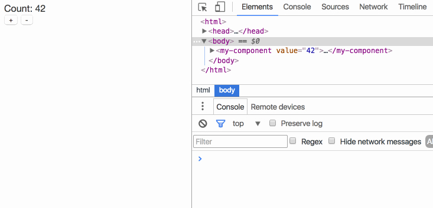

# This project is deprecated — Svelte can compile directly to custom elements as of version 1.37 (see [sveltejs/svelte#797](https://github.com/sveltejs/svelte/issues/797) for more info)

---

# svelte-custom-elements

Register Svelte components as custom elements.


## Installation and usage

First, you need to be familiar with [Svelte](https://svelte.technology). Read the [guide](https://svelte.technology/guide) if you haven't already, then come back here!

Install svelte-custom-elements to your project...

```bash
npm install -S svelte-custom-elements
```

...then use it in your app like so:

```js
import Counter from './Counter.html';
import { register } from 'svelte-custom-elements';

register( 'my-component', Counter, [ 'value' ] );

document.body.innerHTML = '<my-component value="42"></my-component>';
```

The `register` function takes three arguments:

1. The tag name you wish to use
2. A Svelte component constructor
3. An optional list of 'observed attributes'. Any properties that you want to get or set (i.e. `component.thing = 'foo'`) must be included in this list.


## Demo

### [Link](https://svelte-custom-elements.surge.sh/) / [Source](https://github.com/sveltejs/svelte-custom-elements/tree/master/demo)




## License

MIT
